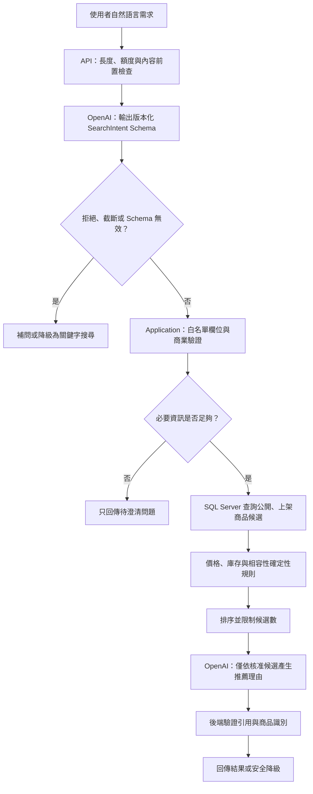
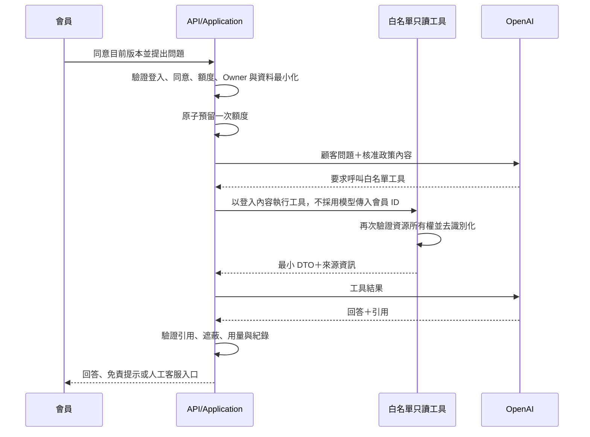

# AI 應用詳細設計

本文件把已確認的 AI 邊界轉成可實作流程。模型分工、API、用途 Enum、補問條件、搜尋意圖、必要規格結構、工具結果、引用、既有零件輸入格式及 DTO 上限均已定案。

## 共通原則

- OpenAI 是可替換的外部服務，不是商品、庫存、價格、相容性、訂單或權限的真實來源。
- 基本電商功能不得依賴 OpenAI 才能運作。
- 所有輸入先由後端做長度、格式、額度與權限檢查；所有輸出再由後端做 Schema 與商業規則驗證。
- 模型沒有資料庫連線、任意 SQL、寫入工具、會員 ID 選擇權或跨會員資料查詢權。
- Prompt、JSON Schema 與工具契約採不可覆寫的版本化檔案；每次互動保存實際版本及模型識別。

OpenAI 官方將 Structured Outputs 定義為讓模型輸出遵循指定 JSON Schema 的機制；本專案仍需保留後端業務驗證，不能把 Schema 遵循等同於資料正確。官方也建議以代表性評估集比較 Prompt 或模型變更，詳見 [Structured Outputs](https://developers.openai.com/api/docs/guides/structured-outputs) 與 [Evaluation best practices](https://developers.openai.com/api/docs/guides/evaluation-best-practices)。

## AI 商品搜尋與推薦流程



### SearchIntent 契約骨架

下表固定已確認的業務概念與主要結構；既有零件支援站內 SKU 或經使用者確認的結構化手填資料。

| 欄位群組 | 意義 | 後端處理 | 狀態 |
|---|---|---|---|
| `intent` | 單品、整機或組裝需求 | 只接受 `SingleProduct`、`PrebuiltComputer`、`CustomBuild` | 已確認 |
| `purposes` | 使用目的，可多選 | 固定對應系統用途標籤 | 已確認八項 Enum |
| `budget` | 預算下限、上限與幣別 | 新台幣、非負值、上下限一致 | 概念已確認 |
| `brands` | 偏好與排除品牌 | 只對應既有品牌識別 | 概念已確認 |
| `requiredSpecs` | 必要規格 | `{ semanticKey, operator, value, unit }[]`；後端驗證語意鍵與單位白名單 | 主要結構已確認 |
| `preferences` | 軟性偏好 | 只影響排序，不放寬硬限制 | 概念已確認 |
| `existingParts` | 已有零件 | 只接受站內 SKU 或使用者確認的結構化手填資料，再交相容性規則 | 已確認 |
| `clarificationQuestions` | 缺少必要資訊時的補問 | 有值時不執行商品查詢；每次最多 2 題 | 觸發規則已確認 |

`purposes` 只接受：

```text
Gaming
VideoEditing
ThreeDRendering
GraphicDesign
Office
Programming
Streaming
General
```

模型不得建立新 Enum；無法對應時保留待澄清，而不是把任意文字直接帶入 SQL。

`requiredSpecs.operator` 只允許 `eq`、`gte`、`lte`、`in`。模型不得傳入資料庫欄名；`semanticKey` 與 `unit` 必須由分類規格白名單解析。重複或互相衝突的條件交由後端拒絕或要求澄清，不由模型自行取捨。

### SearchIntent 大小與型別限制

| 項目 | 上限／型別 |
|---|---|
| 使用者自然語言輸入 | 2,000 Unicode 字元 |
| `purposes` | 最多 4 個唯一 Enum |
| `budget.min`／`max` | decimal 語意、0～10,000,000 TWD |
| 偏好／排除品牌 | 各最多 5 個既有 Brand PublicId，不可重複或同時偏好與排除 |
| `requiredSpecs` | 最多 12 筆 |
| `semanticKey` | 最多 64 個 ASCII 小寫字母、數字、`.`、`_`、`-` |
| `value` | `string`（100 字）、decimal、boolean 或最多 10 個各 100 字的 string array |
| `unit` | Null 或最多 16 字元的受控 Unit Code |
| `preferences` | 最多 10 筆，每筆 Key 64 字、值 100 字 |
| `existingParts` | 最多 12 筆；使用下列 `ExistingPartInput` Union |
| `clarificationQuestions` | 最多 2 題，每題 160 字 |

超過上限在呼叫 OpenAI 前回 400；模型回傳超限或型別錯誤視為 Schema 無效，不截斷後繼續查詢。

### ExistingPartInput

```json
{
  "source": "CatalogSku",
  "skuPublicId": "019...",
  "quantity": 1,
  "confirmedByUser": true
}
```

或：

```json
{
  "source": "StructuredManual",
  "categoryCode": "GPU",
  "displayName": "使用者既有顯示卡",
  "quantity": 1,
  "specifications": [
    { "semanticKey": "gpu.tgp_w", "value": 285, "unit": "W" }
  ],
  "confirmedByUser": true
}
```

- `source` 只接受 `CatalogSku` 或 `StructuredManual`；兩種型別欄位互斥。
- `quantity` 為 1～8；`displayName` 最多 160 字；手填規格最多 12 筆，沿用 requiredSpecs 的 Semantic Key、Value 與 Unit 上限。
- `CatalogSku` 由後端讀取目前結構化規格，不接受前端同時覆寫規格。
- `StructuredManual` 必須包含該零件分類參與相容性硬規則的所有必要欄位；缺少時回補問或 `InsufficientData`，不得推測。
- 自然語言可由 AI 解析成 `ProposedExistingPart` 候選，但候選不得進入 `existingParts` 或相容性計算；前端必須顯示解析欄位並由使用者確認，確認後才設定 `confirmedByUser=true`。
- AI 不可把自由文字直接匹配成某個站內 SKU；若提供候選 SKU，必須列出可辨識差異並等待使用者選擇。

### 必要資訊與補問

- 完整組裝需求至少需要一個用途與最高預算。
- 單品需求至少需要商品類別或可辨識的商品關鍵字。
- 缺少上述硬性必要資訊時，每次最多提出 2 個澄清問題，且不執行商品查詢。
- 只有品牌或其他軟性偏好缺少時可直接搜尋，不強迫補問。
- 使用者拒絕補充時，提供一般關鍵字搜尋與篩選，不自行猜測預算或硬性規格。

### 搜尋失敗與降級

| 情境 | 處理 |
|---|---|
| 搜尋呼叫超過 8 秒 | 中止 AI 流程；依錯誤類型決定是否已使用一次重試 |
| 限流或暫時性服務錯誤 | 短暫退避後最多重試一次 |
| Schema 格式錯誤 | 最多進行一次格式修復；仍失敗即降級 |
| 必要資訊不足 | 回傳澄清問題，不執行 SQL 商品查詢 |
| 無合法候選 | 顯示無結果原因及可放寬條件，不虛構商品 |
| OpenAI 不可用 | 使用既有關鍵字搜尋與一般篩選 |

## AI 客服流程



### 第一版工具白名單

第一版固定使用下列四個只讀工具；工具是 Application 能力，不等同公開 API 路由。

| 工具 | 輸入邊界 | 最小輸出 | 授權規則 |
|---|---|---|---|
| `get_my_order_summary` | 訂單編號；不接受會員 ID | 訂單狀態、付款／出貨摘要、商品名稱與數量、可執行流程提示、來源 | 從登入內容取得會員，訂單必須屬於本人 |
| `search_public_faq` | 查詢文字、可選分類 | FAQ 標題、核准答案、版本與來源 | 只查已發布公開 FAQ |
| `get_return_policy` | 主題、可選訂單情境 | 適用規則、限制、政策版本與來源 | 政策為公開內容；個案判斷仍以後端資料為準 |
| `get_public_product_detail` | 系統商品或 SKU 識別 | 公開名稱、規格、價格、庫存狀態與來源 | 只回傳上架且可公開欄位 |

工具永遠回傳 Result Union：`ok`、`not_found`、`forbidden`、`state_conflict`、`unavailable`。失敗結果只包含安全錯誤碼與模型可見的最小提示，不丟出 Exception 訊息、不回傳 Stack Trace，也不把其他顧客資料交給模型。工具描述需明列輸入、輸出、錯誤、是否可重試及不得推論的範圍。

### 工具 DTO 限制

| 工具 | 輸入上限 | 輸出上限 |
|---|---|---|
| `get_my_order_summary` | 訂單編號 32 字 | 最多 30 個明細；狀態／流程提示各 300 字 |
| `search_public_faq` | Query 500 字、單一受控分類 | 最多 5 筆；每筆答案 1,500 字 |
| `get_return_policy` | Topic 100 字、單一情境 Enum | 最多 5 條規則；每條 800 字 |
| `get_public_product_detail` | Product／SKU PublicId | 最多 20 個公開規格；規格顯示值 200 字 |

共同回應的安全訊息最多 300 字、來源最多 8 個；工具結果超過上限時由 Application 依穩定排序裁切並明示 `isTruncated`，不能讓模型猜測遺漏內容。

### 引用契約骨架

每個可被顧客看見的事實性答案，應能回連至後端提供的來源。引用固定包含來源類型、來源 ID、標題及版本／更新時間。

```json
{
  "answer": "string",
  "citations": [
    {
      "sourceType": "order|faq|return_policy|product",
      "sourceId": "string",
      "title": "string",
      "versionOrUpdatedAt": "string"
    }
  ],
  "needsHumanSupport": false
}
```

模型不得自行產生可點擊的任意外部網址；前端只依 `sourceType` 與 `sourceId` 建立系統內允許的導向。

額度預留發生在登入、同意、剩餘額度、內容安全與資源 Owner 檢查全部通過之後、第一次模型呼叫之前。成功預留後即使模型逾時、拒絕或服務失敗也不退還；同一次互動的內部重試沿用同一 Request PublicId，不得再次扣用。正式 Admission Gate 必須以資料庫交易或等價原子操作處理併發與冪等，不可使用「先讀剩餘量、再於記憶體減一」。

## 隱私、授權與紀錄邊界

- 姓名、Email、電話、地址、密碼、Cookie、Token、API Key 及其他祕密禁止送往 OpenAI。
- 訂單工具只查當前登入會員自己的訂單；GuestOrderAccessToken 不具 AI 客服權限。
- 顧客歷史客服對話只限同一顧客／案件目的，不得成為其他顧客知識來源。
- 模型要求忽略規則、擴張工具範圍或取得原始 Prompt 時，一律視為不可信輸入。
- OpenAI 原始請求與回答依已確認規則保存 90 天；已結案件原始對話保存 180 天。
- 每次互動記錄用途、模型、Token、估算成本、成功／失敗、降級、Prompt Version、Schema Version 與 Tool Contract Version。

## 模型與 API

| 功能 | 模型 | 調整規則 |
|---|---|---|
| 商品搜尋解析 | `gpt-5.6-luna` | 未通過評估門檻時才提出升級決策 |
| AI 客服 | `gpt-5.6-terra` | 優先確保政策與工具回答品質 |
| S 功能摘要 | `gpt-5.6-luna` | 未啟動 S 功能時不產生成本 |

- 統一使用 OpenAI Responses API；工具與 Structured Outputs 只能經後端 Adapter 呼叫。官方介面說明見 [Responses API migration guide](https://developers.openai.com/api/docs/guides/migrate-to-responses)。
- 開發期由設定指定模型 Alias；Day 35 功能凍結後，若模型提供 Snapshot，鎖定已通過 120 筆評估集的 Snapshot。
- 若帳號無法使用選定模型或 Snapshot，不得由開發者自行換模；需記錄成本、品質與相容性後重新決策。
- AI 客服 Adapter 直接以既有 `HttpClient` 呼叫固定的 Responses Endpoint，不新增 OpenAI SDK 或可設定的外送 Host；正式 DI 仍只暴露 `IAiSupportModelClient`。
- AI 客服 Request 固定 `store=false`，不送 `previous_response_id`，第一版也不在此 Adapter 暴露 Tool；此設定不取代本系統自身的 90／180／365 天保存與清除規則。
- 設定鍵為 `OpenAI:ApiKey`、`OpenAI:SupportModel` 與 `OpenAI:SupportTimeoutMilliseconds`；預設模型 `gpt-5.6-terra`、單次嘗試 12 秒，功能啟用時缺少或不合法設定即啟動失敗。
- 429、Request Timeout、5xx、網路失敗、回應截斷或結構不合法最多重試一次；其他 4xx、模型明確轉人工與呼叫端取消不重試。重試只發生在同一次已預留互動，不重扣或退款額度。
- 輸出使用 strict JSON Schema；答案最多 4,000 字、引用最多 8 筆。引用必須匹配本次後端核准來源，標題與版本由後端可信資料覆寫，不採用模型提供的 URL。成功回應必須帶回 Provider 實際模型名稱及 Input／Output Token；缺少或不合法時 Fail Closed。

既有零件識別格式與 Clarification Precision／Recall 發布門檻均已定版；120 筆繁中 draft 評估資料、合成 Fixture、Grader Contract 與 deterministic 驗證已建立於 `FP.dev/evals/ai/v1`。Application 已建立 32 項 AI 安全測試；API 的 `POST /api/v1/ai/support/messages` 具 Member／Guest 雙 Scheme 的 `AiSupport.Member` Policy，真正 GuestOrderAccess Cookie 通過 Authentication 後因缺 Member Claim 回 403。Infrastructure 已接上 `EfAiSupportAdmissionGate` 與 `EfAiSupportContextReader`：前者只接受 `AiConsentPolicy.CurrentVersion=1`、`Purpose=Support` 範圍內的最新 append-only 同意，以 `Asia/Taipei` 00:00 日界線、Serializable 交易、SQL Server Key-range Lock 與 RequestPublicId UX 原子預留每日 20 則；後者只依可信 Member ID 查本人訂單並輸出去識別最小 JSON。資料庫故障、內容安全或 Owner 不符均 Fail Closed，不呼叫模型。

AI-13 與 Adapter 現有證據為 Domain 4、Application 32、Infrastructure 19、API 10；Migration `20260828050333_AddAiSafetyConsentAndUsage` 只新增 `AiConsentRecords` 與 `AiUsageLedger`、索引、Check Constraint 與 Restrict FK，尚未套用共用開發資料庫。Provider-backed 測試另證明版本不符不會預留額度、每日額度在台灣午夜重置。客服 Responses Adapter 的 11 項零外部呼叫測試涵蓋無狀態 Payload、授權、strict Schema、可信引用、模型／Token、重試、非暫時錯誤、轉人工、取消、非法來源、Null 引用及非法語系；Application 另驗證模型／Token 會傳回 Use Case 結果供 M-19 保存。剩餘工作為 Terry／Kafen 評估資料覆核、搜尋專用 Adapter／Endpoint、M-19 同意／撤回 Endpoint 與客服歷史 Query、前端 E2E，以及真實模型品質、P95 與成本 baseline。
