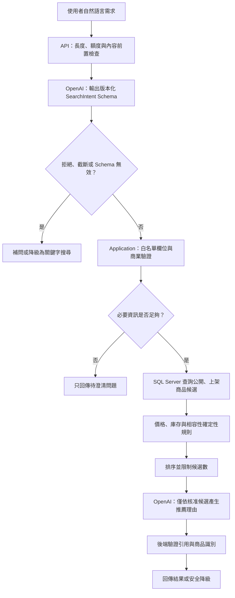
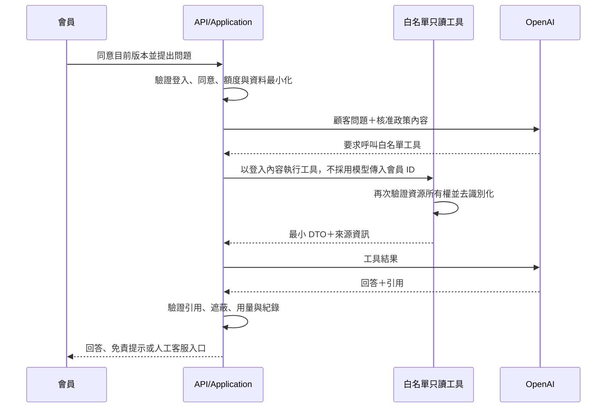

# AI 應用詳細設計

本文件把已確認的 AI 邊界轉成可實作流程。模型分工、API、用途 Enum、補問條件、工具與引用欄位已定案；SearchIntent 其他 Enum、DTO 長度與數量上限仍待契約定版。

## 共通原則

- OpenAI 是可替換的外部服務，不是商品、庫存、價格、相容性、訂單或權限的真實來源。
- 基本電商功能不得依賴 OpenAI 才能運作。
- 所有輸入先由後端做長度、格式、額度與權限檢查；所有輸出再由後端做 Schema 與商業規則驗證。
- 模型沒有資料庫連線、任意 SQL、寫入工具、會員 ID 選擇權或跨會員資料查詢權。
- Prompt、JSON Schema 與工具契約採不可覆寫的版本化檔案；每次互動保存實際版本及模型識別。

OpenAI 官方將 Structured Outputs 定義為讓模型輸出遵循指定 JSON Schema 的機制；本專案仍需保留後端業務驗證，不能把 Schema 遵循等同於資料正確。官方也建議以代表性評估集比較 Prompt 或模型變更，詳見 [Structured Outputs](https://developers.openai.com/api/docs/guides/structured-outputs) 與 [Evaluation best practices](https://developers.openai.com/api/docs/guides/evaluation-best-practices)。

## AI 商品搜尋與推薦流程



### SearchIntent 契約骨架

下表只固定已確認的業務概念；精確 JSON 型別、Enum 值、長度與數量上限由後續決策定版。

| 欄位群組 | 意義 | 後端處理 | 狀態 |
|---|---|---|---|
| `intent` | 單品、整機或組裝需求 | 只接受白名單 Enum | 精確 Enum 待決策 |
| `purposes` | 使用目的，可多選 | 固定對應系統用途標籤 | 已確認八項 Enum |
| `budget` | 預算下限、上限與幣別 | 新台幣、非負值、上下限一致 | 概念已確認 |
| `brands` | 偏好與排除品牌 | 只對應既有品牌識別 | 概念已確認 |
| `requiredSpecs` | 必要規格 | 轉成分類規格白名單，不接受 DB 欄名 | 欄位待決策 |
| `preferences` | 軟性偏好 | 只影響排序，不放寬硬限制 | 概念已確認 |
| `existingParts` | 已有零件 | 轉成相容性檢查輸入 | 識別格式待決策 |
| `clarificationQuestions` | 缺少必要資訊時的補問 | 有值時不執行商品查詢；每次最多 2 題 | 觸發規則已確認 |

`purposes` 只接受：

```text
Gaming
VideoEditing
ThreeDRendering
GraphicDesign
Office
Programming
Streaming
General
```

模型不得建立新 Enum；無法對應時保留待澄清，而不是把任意文字直接帶入 SQL。

### 必要資訊與補問

- 完整組裝需求至少需要一個用途與最高預算。
- 單品需求至少需要商品類別或可辨識的商品關鍵字。
- 缺少上述硬性必要資訊時，每次最多提出 2 個澄清問題，且不執行商品查詢。
- 只有品牌或其他軟性偏好缺少時可直接搜尋，不強迫補問。
- 使用者拒絕補充時，提供一般關鍵字搜尋與篩選，不自行猜測預算或硬性規格。

### 搜尋失敗與降級

| 情境 | 處理 |
|---|---|
| 搜尋呼叫超過 8 秒 | 中止 AI 流程；依錯誤類型決定是否已使用一次重試 |
| 限流或暫時性服務錯誤 | 短暫退避後最多重試一次 |
| Schema 格式錯誤 | 最多進行一次格式修復；仍失敗即降級 |
| 必要資訊不足 | 回傳澄清問題，不執行 SQL 商品查詢 |
| 無合法候選 | 顯示無結果原因及可放寬條件，不虛構商品 |
| OpenAI 不可用 | 使用既有關鍵字搜尋與一般篩選 |

## AI 客服流程



### 第一版工具白名單

第一版固定使用下列四個只讀工具；工具是 Application 能力，不等同公開 API 路由。

| 工具 | 輸入邊界 | 最小輸出 | 授權規則 |
|---|---|---|---|
| `get_my_order_summary` | 訂單編號；不接受會員 ID | 訂單狀態、付款／出貨摘要、商品名稱與數量、可執行流程提示、來源 | 從登入內容取得會員，訂單必須屬於本人 |
| `search_public_faq` | 查詢文字、可選分類 | FAQ 標題、核准答案、版本與來源 | 只查已發布公開 FAQ |
| `get_return_policy` | 主題、可選訂單情境 | 適用規則、限制、政策版本與來源 | 政策為公開內容；個案判斷仍以後端資料為準 |
| `get_public_product_detail` | 系統商品或 SKU 識別 | 公開名稱、規格、價格、庫存狀態與來源 | 只回傳上架且可公開欄位 |

工具發生 `not_found`、`forbidden`、`state_conflict` 或暫時性錯誤時，回傳穩定結果碼，不把內部例外或其他顧客資料交給模型。工具描述需明列輸入、輸出、錯誤及不得推論的範圍；這也符合 OpenAI 對工具契約應明確描述欄位、型別與錯誤行為的建議。

### 引用契約骨架

每個可被顧客看見的事實性答案，應能回連至後端提供的來源。引用固定包含來源類型、來源 ID、標題及版本／更新時間。

```json
{
  "answer": "string",
  "citations": [
    {
      "sourceType": "order|faq|return_policy|product",
      "sourceId": "string",
      "title": "string",
      "versionOrUpdatedAt": "string"
    }
  ],
  "needsHumanSupport": false
}
```

模型不得自行產生可點擊的任意外部網址；前端只依 `sourceType` 與 `sourceId` 建立系統內允許的導向。

## 隱私、授權與紀錄邊界

- 姓名、Email、電話、地址、密碼、Cookie、Token、API Key 及其他祕密禁止送往 OpenAI。
- 訂單工具只查當前登入會員自己的訂單；GuestOrderAccessToken 不具 AI 客服權限。
- 顧客歷史客服對話只限同一顧客／案件目的，不得成為其他顧客知識來源。
- 模型要求忽略規則、擴張工具範圍或取得原始 Prompt 時，一律視為不可信輸入。
- OpenAI 原始請求與回答依已確認規則保存 90 天；已結案件原始對話保存 180 天。
- 每次互動記錄用途、模型、Token、估算成本、成功／失敗、降級、Prompt Version、Schema Version 與 Tool Contract Version。

## 模型與 API

| 功能 | 模型 | 調整規則 |
|---|---|---|
| 商品搜尋解析 | `gpt-5.6-luna` | 未通過評估門檻時才提出升級決策 |
| AI 客服 | `gpt-5.6-terra` | 優先確保政策與工具回答品質 |
| S 功能摘要 | `gpt-5.6-luna` | 未啟動 S 功能時不產生成本 |

- 統一使用 OpenAI Responses API；工具與 Structured Outputs 只能經後端 Adapter 呼叫。官方介面說明見 [Responses API migration guide](https://developers.openai.com/api/docs/guides/migrate-to-responses)。
- 開發期由設定指定模型 Alias；Day 35 功能凍結後，若模型提供 Snapshot，鎖定已通過 120 筆評估集的 Snapshot。
- 若帳號無法使用選定模型或 Snapshot，不得由開發者自行換模；需記錄成本、品質與相容性後重新決策。
- OpenAI Request 是否保存必須明確設定，且不取代本系統自身的 90／180 天保存規則。

目前仍需定版 SearchIntent 的 `intent` Enum、規格欄位型別／數量上限，以及四個工具的最終 DTO 長度與錯誤範例。
