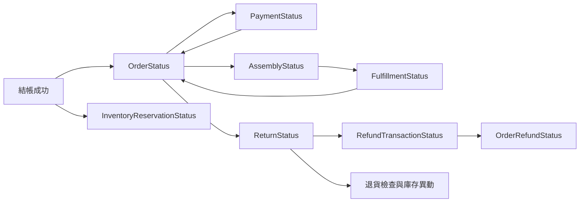
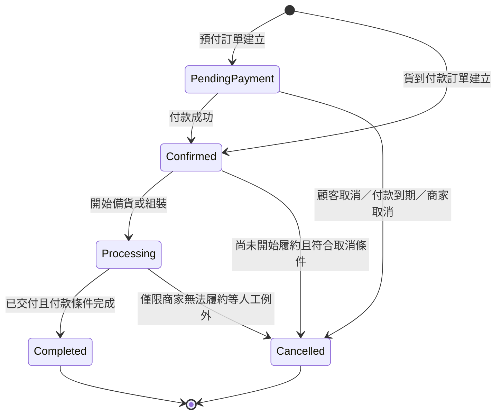
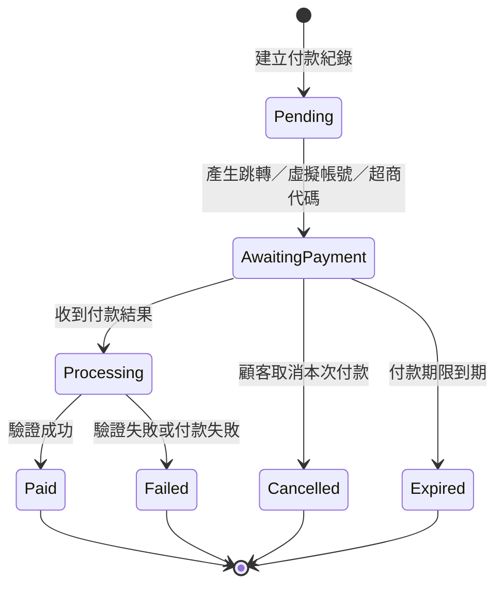
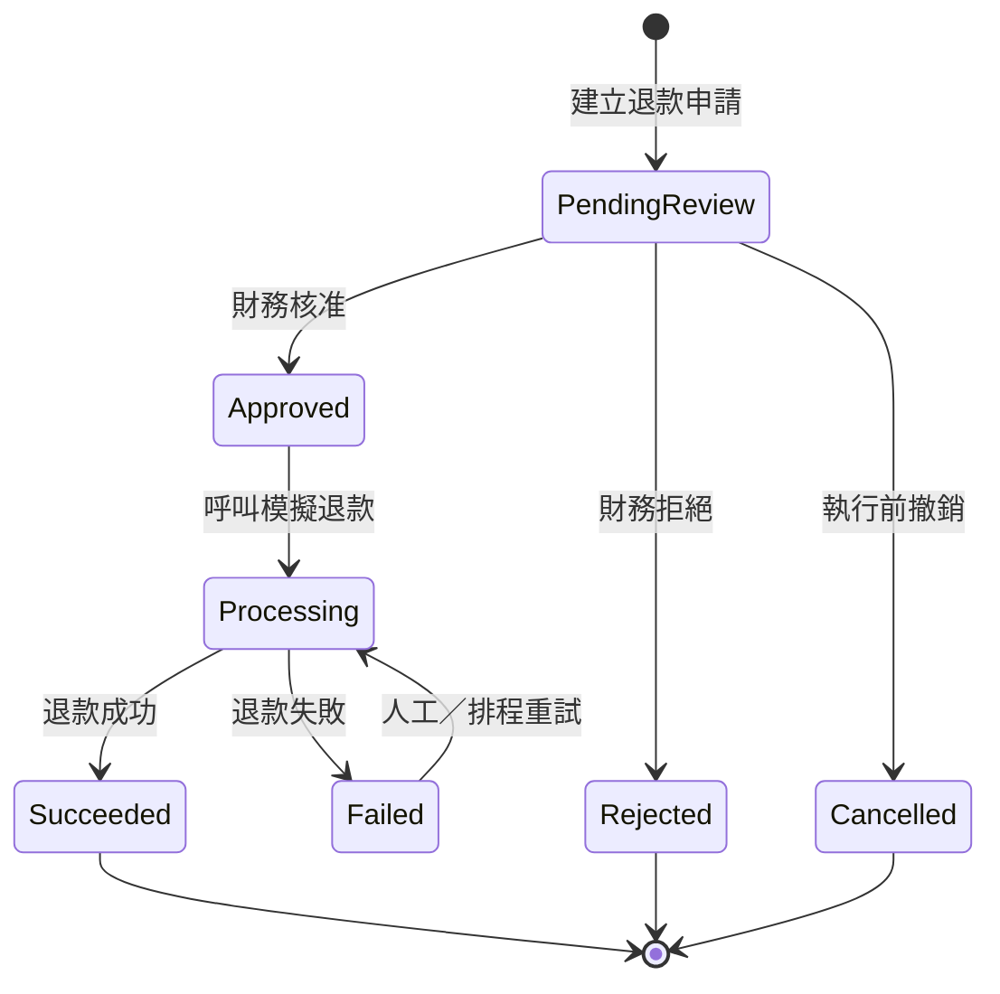
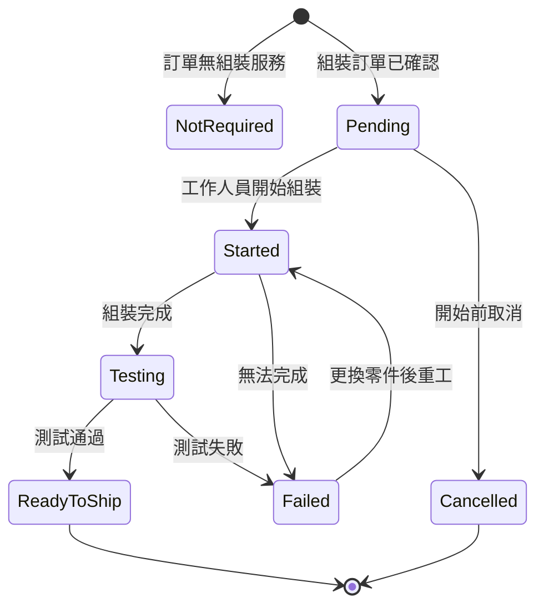
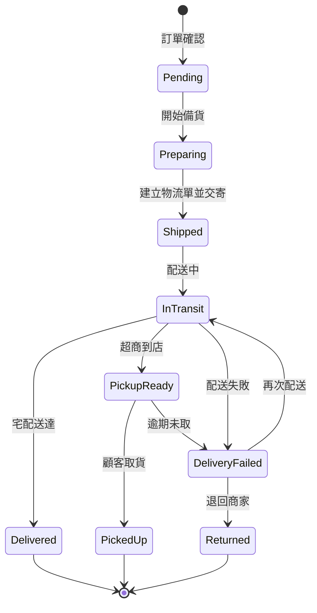
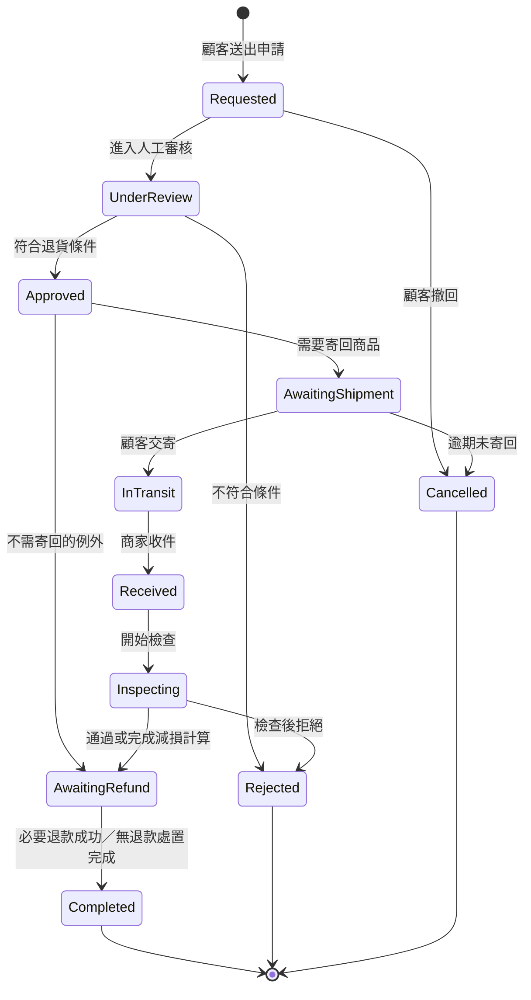
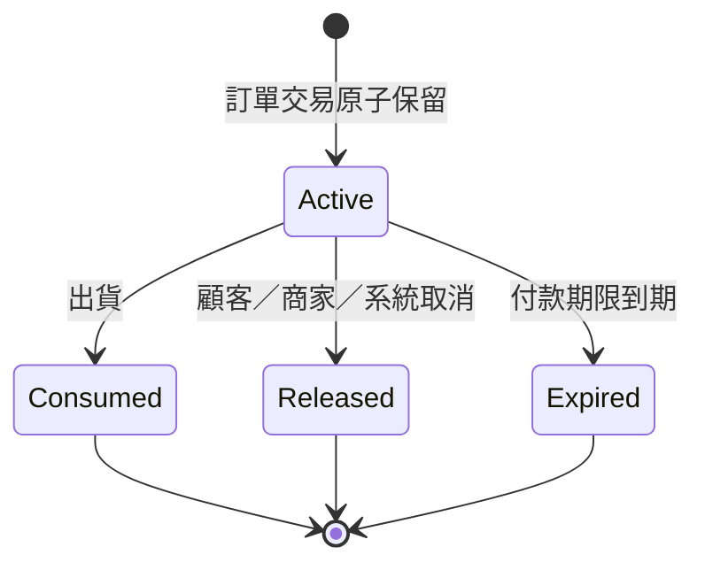
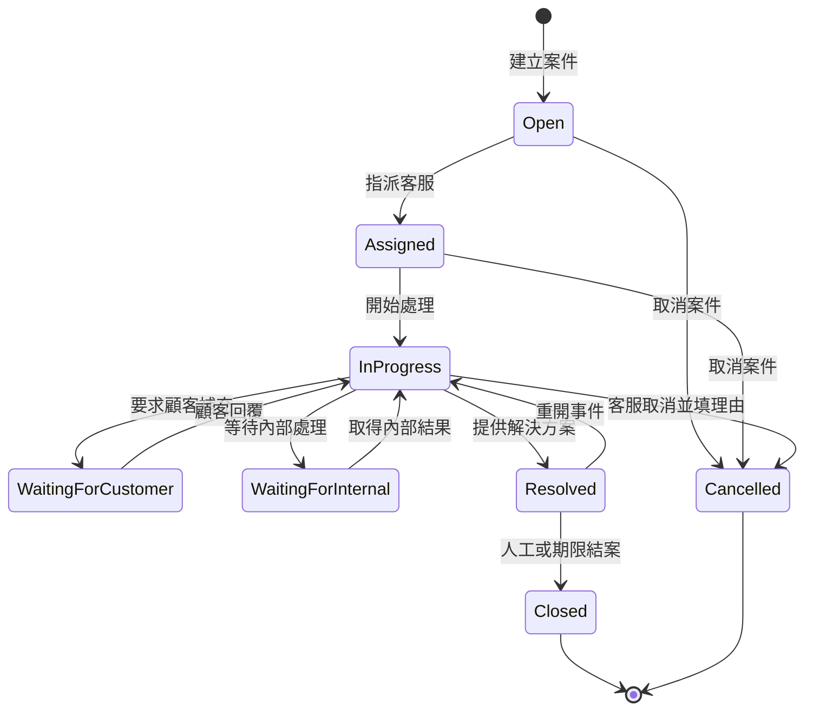

# 狀態機設計

本文件把訂單、付款、退款、組裝、物流、退貨、庫存保留與客服案件拆成獨立狀態機。主要狀態與轉移及客服案件取消條件均已確認。

## 共通原則

1. 每個狀態只表達一個領域概念，不以單一 `OrderStatus` 取代付款、組裝、物流、退貨或退款狀態。
2. 狀態只能透過 Application Service 的明確操作轉移，不允許 Controller 或前端直接指定任意新狀態。
3. 每次轉移驗證目前狀態、操作者權限、必要前置條件及 `RowVersion`。
4. 關鍵狀態轉移、庫存異動、通知與稽核紀錄應在同一交易中完成，或透過可靠 Outbox 接續處理。
5. 付款回呼、退款回呼、庫存釋放、逾時取消與背景工作必須冪等。
6. 所有轉移保存 `OccurredAtUtc`、原因、操作者及 TraceId；前台顯示時轉為台灣時區。
7. 進入終態後不得倒退；若要重試，建立新的 Attempt/Transaction，或走文件明訂的重新開啟轉移。

## 狀態機之間的關係



## 1. 訂單狀態 `OrderStatus`

### 已確認狀態

| 狀態 | 中文 | 說明 |
|---|---|---|
| `PendingPayment` | 等待付款 | 預付訂單已成立並保留庫存，尚未付款成功 |
| `Confirmed` | 已確認 | 已付款，或貨到付款訂單已成立，可進入履約 |
| `Processing` | 處理中 | 已開始備貨或組裝 |
| `Completed` | 已完成 | 商品已送達/取貨，且必要付款已完成 |
| `Cancelled` | 已取消 | 履約前因顧客、逾時、缺貨、系統或商家而終止 |

### 狀態圖



### 轉移規則

| 目前狀態 | 操作／事件 | 下一狀態 | 必要條件與副作用 |
|---|---|---|---|
| 無 | 建立預付訂單 | `PendingPayment` | 原子建立訂單、快照、優惠券使用與庫存保留；建立付款期限 |
| 無 | 建立貨到付款訂單 | `Confirmed` | 一般宅配或超商取貨、最終應付金額不超過 NT$20,000，且未含組裝電腦或限制品；原子保留庫存並建立 COD Payment |
| `PendingPayment` | 付款成功 | `Confirmed` | 付款回呼冪等；保存 `PaidAtUtc`；通知顧客 |
| `PendingPayment` | 付款期限到期 | `Cancelled` | 同交易將保留標為到期、釋放庫存、按規則返還優惠券次數 |
| `PendingPayment` | 顧客/訪客取消 | `Cancelled` | 驗證本人或限單 Token；釋放庫存；返還優惠券次數 |
| `Confirmed` | 開始備貨或組裝 | `Processing` | 一般商品進入備貨；客製電腦至少進入 `AssemblyStarted` |
| `Confirmed` | 允許取消 | `Cancelled` | 尚未出貨且客製組裝未開始；已付款者建立退款流程 |
| `Processing` | 完成交付 | `Completed` | 宅配為 `Delivered`；超取為 `PickedUp`；COD 同時須付款成功 |
| `Processing` | 商家無法履約 | `Cancelled` | 人工權限、原因、退款、尚未出貨庫存釋放及稽核紀錄 |

### 設計邊界

- 付款失敗或使用者取消某一次付款，不立即把訂單改成 `Cancelled`；在原付款期限內可建立新的付款嘗試。
- 第一版不建立 `OrderCancellationRequest`，也不增加 `CancellationRequested` 訂單狀態。符合條件者直接取消；不符合者前台阻擋。具例外取消權限的管理員可以在商家無法履約等情況下附理由人工取消並留下稽核紀錄；精確角色由權限矩陣定義。
- 已出貨後不再使用取消，改走拒收、配送退回或退貨流程。
- `Completed` 後發生部分退款，訂單仍保持完成；退款結果由獨立狀態表達。
- 後台的「待出貨、已出貨、已完成、已取消」只能是多個狀態機的衍生顯示，不得取代本狀態或由前端直接指定。

## 2. 付款狀態 `PaymentStatus`

`RefundPending`、`PartiallyRefunded`、`Refunded` 不放在付款狀態中，因為它們描述的是退款，不是付款嘗試。

### 已確認狀態

| 狀態 | 中文 | 說明 |
|---|---|---|
| `Pending` | 待開始 | 已建立付款紀錄，尚未完成付款指示或跳轉 |
| `AwaitingPayment` | 等待顧客付款 | 等待即時付款操作、ATM 入帳或超商代碼繳費 |
| `Processing` | 確認中 | 已收到結果，正在驗證並套用回呼 |
| `Paid` | 已付款 | 本次付款成功的終態 |
| `Failed` | 付款失敗 | 本次付款失敗的終態 |
| `Cancelled` | 付款取消 | 顧客取消本次付款的終態 |
| `Expired` | 付款逾時 | 本次付款方式或代碼超過期限的終態 |



### 規則

- `Payment` 表達一次付款嘗試；失敗、取消或到期後重試時建立新紀錄，不讓終態倒退。
- 相同 Provider Transaction Id 或 Idempotency Key 的回呼只能產生一次副作用。
- 即時付款的保留期限為 15 分鐘；ATM 與超商代碼為 3 天。
- 貨到付款訂單建立時建立 `AwaitingPayment` 的 COD 付款紀錄。宅配 `Delivered` 或超取 `PickedUp` 時轉成 `Paid`；配送失敗或逾期未取並確認退回、不再收款時轉成 `Cancelled`。

## 3. 退款狀態

把「訂單累計退款情況」與「單次退款交易結果」分開，避免一筆訂單有多次部分退款時無法正確表達。

### 訂單退款彙總 `OrderRefundStatus`

| 狀態 | 說明 |
|---|---|
| `None` | 尚無退款 |
| `Pending` | 至少一筆退款正在審核或處理 |
| `PartiallyRefunded` | 累計成功退款大於零且小於可退款總額 |
| `Refunded` | 可退款總額已全數退回 |

### 單次退款交易 `RefundTransactionStatus`

| 狀態 | 說明 |
|---|---|
| `PendingReview` | 等待人工審核 |
| `Approved` | 已核准，等待執行退款 |
| `Processing` | 模擬閘道處理中 |
| `Succeeded` | 本次退款成功 |
| `Rejected` | 人工審核拒絕 |
| `Failed` | 執行退款失敗，可依規則重試 |
| `Cancelled` | 在執行前撤銷 |



成功後重新計算 `OrderRefundStatus`。退款金額不得超過原付款扣除既有成功退款後的餘額，且必須保存商品、折扣追回、運費、組裝費與調整明細。

## 4. 組裝狀態 `AssemblyStatus`

既有「Draft → Submitted → Paid → AssemblyPending → ... → Shipped」混合了組裝清單、訂單、付款與物流。第一版組裝狀態固定只描述組裝作業：

| 狀態 | 中文 | 說明 |
|---|---|---|
| `NotRequired` | 不需組裝 | 訂單沒有客製組裝電腦 |
| `Pending` | 等待組裝 | 訂單已確認，尚未開始組裝 |
| `Started` | 已開始組裝 | 已開始實際組裝，無理由取消限制生效 |
| `Testing` | 測試中 | 組裝完成，執行開機與基本測試 |
| `ReadyToShip` | 可出貨 | 組裝與測試通過，可進入物流 |
| `Failed` | 組裝失敗 | 缺件、故障或無法完成，需人工處理 |
| `Cancelled` | 組裝取消 | 在允許階段取消或商家終止 |



- `Draft` 屬於 `BuildConfiguration`，不是組裝作業。
- `Submitted` 屬於結帳/訂單建立事件；`Paid` 屬於付款；`Shipped` 屬於物流。
- `Started` 後顧客不能自行無理由取消，但商家責任、瑕疵或人工審核仍可處理。
- 同一組裝清單可以購買多台，每台建立獨立 `AssemblyJob`，各自保存 `AssemblyStatus` 及歷程。
- 建立訂單時仍以所有組裝台數所需的 SKU 總量原子保留庫存；任一項不足則整筆回滾。

## 5. 物流狀態 `FulfillmentStatus`

本節列出的九個狀態是 `Shipments.Status` 唯一合法清單；資料表、Enum、API DTO、匯入資料與前端顯示不得自行增加別名或省略狀態，轉移只能依下圖進行。

### 狀態圖



| 轉移 | 必要副作用 |
|---|---|
| `Preparing → Shipped` | 原子將保留庫存轉為出貨：`OnHandQuantity` 與 `ReservedQuantity` 同時減少，建立 `InventoryMovement(Ship)` |
| `InTransit → Delivered` | 保存宅配送達時間、計算一般退貨期限；若為宅配 COD，同步完成付款 |
| `PickupReady → PickedUp` | 保存取貨時間；若為超取 COD，同步完成付款 |
| `DeliveryFailed → Returned` | 建立退回歷程；訂單、付款、庫存後續處理不得只靠物流狀態自動猜測 |

- 組裝電腦只有 `AssemblyStatus = ReadyToShip` 才能進入 `Shipped`。
- 第一版一張訂單只允許一種配送方式、一張主要物流單且同批履約。需要不同配送方式時，必須在結帳前拆成不同訂單。

## 6. 退貨狀態 `ReturnStatus`

### 已確認狀態

| 狀態 | 中文 | 說明 |
|---|---|---|
| `Requested` | 已申請 | 顧客送出原因、項目與圖片 |
| `UnderReview` | 審核中 | 管理員檢查資格與證據 |
| `Approved` | 已核准 | 允許寄回或進入不需寄回的退款流程 |
| `Rejected` | 已拒絕 | 不符合規則並保存理由 |
| `AwaitingShipment` | 等待顧客寄回 | 已提供退貨方式，尚未交寄 |
| `InTransit` | 退貨運送中 | 商品正在送回商家 |
| `Received` | 商家已收件 | 商家確認收到退貨包裹 |
| `Inspecting` | 商品檢查中 | 檢查完整性、瑕疵、缺件及價值減損 |
| `AwaitingRefund` | 等待退款 | 檢查完成並產生退款計算，等待財務處理 |
| `Completed` | 已完成 | 退貨處理及必要退款均完成 |
| `Cancelled` | 已取消 | 顧客在允許階段撤回，或逾期未寄回 |



### 規則

- 一個 `ReturnRequest` 可包含同一訂單的一個或多個 `ReturnItem`，但每個項目與數量不得超過可退數量。
- 審核前重新驗證到貨日、政策快照、退貨原因、客製組裝限制及先前退貨/退款量。
- `Inspecting` 需建立 `ReturnInspection`，紀錄商品狀態、附件、缺件、價值減損及回補庫存決策。
- 退貨通過不等於退款完成；成功退款由 `RefundTransactionStatus` 表達。
- 核准後需寄回的案件進入 `AwaitingShipment`，顧客必須在 7 個日曆日內交寄。
- 主管可在到期前核准一次延長 7 個日曆日，需保存原因、稽核紀錄並通知顧客。
- 到期未寄回時自動轉為 `Cancelled`。
- 只有檢查結果為 `Resellable` 時建立 `ReturnToStock` 並回補實體在庫；其他結果進入隔離處置，不增加可售庫存。

## 7. 庫存保留狀態 `InventoryReservationStatus`

| 狀態 | 說明 |
|---|---|
| `Active` | 保留有效，數量已計入 `ReservedQuantity` |
| `Consumed` | 商品出貨，保留數量與實體在庫同時扣除 |
| `Released` | 訂單取消或人工終止，保留數量已釋放 |
| `Expired` | 付款期限到期，保留數量已由逾時流程釋放 |



### 交易不變量

```text
OnHandQuantity >= 0
ReservedQuantity >= 0
ReservedQuantity <= OnHandQuantity
AvailableQuantity = OnHandQuantity - ReservedQuantity
```

| 轉移 | 庫存數量變化 | 異動類型 |
|---|---|---|
| 建立 → `Active` | `ReservedQuantity += Quantity` | `Reserve` |
| `Active → Consumed` | `OnHandQuantity -= Quantity`；`ReservedQuantity -= Quantity` | `Ship` |
| `Active → Released` | `ReservedQuantity -= Quantity` | `Release` |
| `Active → Expired` | `ReservedQuantity -= Quantity` | `Release`，原因標示 Expired |

- 每筆有效保留只能成功消耗或釋放一次。
- 背景排程與管理員人工逾時處理必須使用同一領域操作，避免重複釋放。
- 多 SKU 訂單建立時全數成功才提交，任何一項不足時整筆回滾並回傳衝突。
- 付款成功不改變庫存保留狀態；只有出貨可將 `Active` 轉成 `Consumed`。
- 具權限管理員可以手動將 `Active` 轉成 `Released`，但必須二次確認、填寫原因、使用相同冪等領域操作並保存 Audit Log。

## 8. 客服案件狀態 `SupportTicketStatus`

狀態集合、主要轉移、SLA 計時、自動結案與取消條件已確認。

| 狀態 | 說明 |
|---|---|
| `Open` | 顧客或 AI fallback 建立，尚未由客服承接 |
| `Assigned` | 已指派客服，尚未開始處理 |
| `InProgress` | 客服處理中 |
| `WaitingForCustomer` | 等待顧客補充資訊或回覆 |
| `WaitingForInternal` | 等待內部單位、主管或其他業務流程提供資訊 |
| `Resolved` | 客服認為問題已解決，保留短期重開機會 |
| `Closed` | 正式結案，不接受一般訊息 |
| `Cancelled` | 案件由符合權限的人員取消，不再處理 |



- 未指派案件進入共用佇列；客服可以自領，主管可以指派及轉派。
- 主管角色為 `CustomerServiceSupervisor`；一般客服自領佇列不涵蓋檢舉與退貨。
- 重開以狀態轉移與歷程事件表達，不建立 `Reopened` 狀態。
- 每次狀態、負責人或 SLA 期限異動都必須保存歷程。

### 優先級與 SLA

- 優先級為 `Low`、`Normal`、`High`、`Urgent`。
- 系統依分類與條件給預設值；會員不能指定；客服可附理由調整，`CustomerServiceSupervisor` 可覆核。
- SLA 採 24×7 日曆時間，以 UTC 計算；AI 回答不計入首次人工回覆。

| 優先級 | 首次人工回覆 | 目標結案 |
|---|---:|---:|
| `Low` | 24 小時 | 5 天 |
| `Normal` | 8 小時 | 3 天 |
| `High` | 4 小時 | 24 小時 |
| `Urgent` | 1 小時 | 8 小時 |

- 進入 `WaitingForCustomer` 時暫停目標結案 SLA；案件因等待顧客而暫停的時間最多計 3 天，超過後恢復計時。
- `WaitingForInternal` 不暫停 SLA。
- `Resolved → InProgress` 的重開事件若發生於 Resolved 後 3 天內，保留首次回覆結果，並從重開時間按當前優先級重算目標結案期限。
- `Resolved` 連續 3 天未重開時自動轉 `Closed`。
- `Closed` 是終態，不允許管理員重開；後續問題建立新的關聯案件。
- 到達首次回覆或目標結案期限的 80% 時通知負責人；到達 100% 時通知負責人與主管、標記 `Overdue` 並排到佇列頂端。
- 逾時不自動轉派，也不自動提高案件優先級。
- 顧客只可在 `Open` 或 `Assigned` 且尚無人工公開回覆時取消。
- 承辦客服或 `CustomerServiceSupervisor` 可在 `Open`、`Assigned`、`InProgress` 取消，但必須填寫原因。
- 已有實質處理結果時使用 `Resolved`，不得用取消隱藏已完成的客服歷程。

## 跨狀態機約束

| 規則 | 約束 |
|---|---|
| 開始履約 | `OrderStatus` 必須為 `Confirmed` 或 `Processing` |
| 組裝出貨 | `AssemblyStatus` 必須為 `ReadyToShip` |
| 出貨扣庫 | `InventoryReservationStatus` 必須為 `Active` |
| 訂單完成 | 物流為 `Delivered` 或 `PickedUp`，且付款要求已滿足 |
| 一般取消 | 尚未出貨，且組裝不得已進入 `Started` |
| 建立退貨 | 訂單項目已交付、仍有可退數量，且符合政策快照 |
| 執行退款 | 有核准退款金額，累計不得超過可退款餘額 |
| 退貨回補庫存 | 必須有完成的 `ReturnInspection` 及明確處置結果 |
