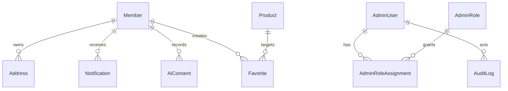
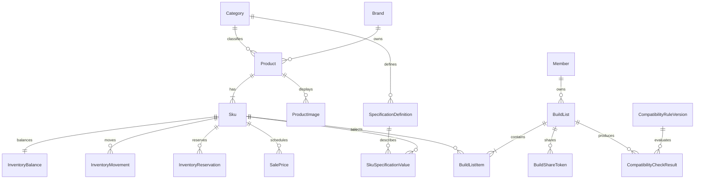
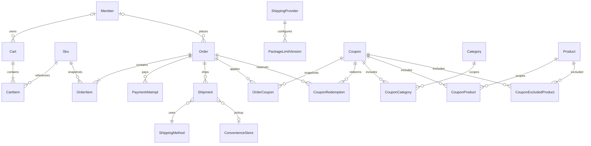
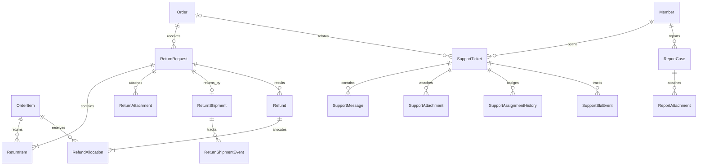
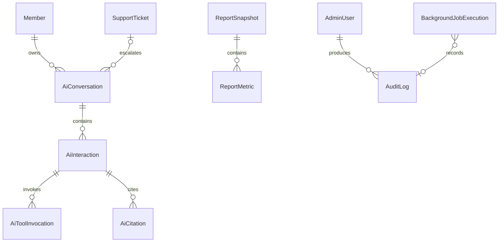

# 資料模型與 ERD

本文件是涵蓋 M 功能的邏輯 ERD，用來確認領域邊界與關聯。完整 SQL Server 型別、Null、索引、刪除行為及正規化分類已分拆至三份領域資料字典；它仍不是已執行的 EF Core Migration。

## 會員、權限與通知

- 會員與管理員共用單一 ASP.NET Core Identity User Store，但 `MemberProfile` 與 `AdminProfile` 分離；Cookie Scheme、角色與 Policy 保持不同登入邊界。
- `MemberProfile` 與 `AdminProfile` 互斥；管理員前台購買使用獨立會員帳號。
- Email、正規化 Email 與其他登入識別需要唯一性；精確索引等待資料字典。
- 多角色權限取聯集，敏感操作仍以明確 Policy 授權並保存稽核。

## 商品、SKU、庫存與組裝

- Product 是共用商品資訊，SKU 是可定價、可庫存與可下單單位。
- 同一 SKU 同一時間不可有重疊有效特價。
- InventoryBalance 保存目前聚合數量；所有保留、釋放、出貨、退貨回補與隔離需留下 InventoryMovement。
- InventoryReservation 只回連 Order、SKU、數量、到期時間與釋放原因；Cart 不建立保留，也不保存 CartId。
- 相容性結果必須保存規則版本；AI 不能修改或取代結果。

## 購物車、訂單、付款與物流

- OrderItem 保存商品名稱、SKU、成交單價、成本、折扣分攤、組裝群組及數量快照。
- Order 保存收件、運費、免運規則、組裝費、優惠與總額快照；歷史訂單不受後台設定變更影響。
- 會員 Address 是可變主資料；Order 以明確 Owned 欄位保存不可變地址快照。
- OrderCoupon 保存優惠、規則版本、最低消費門檻與適用小計快照；OrderItem 保存 `IsCouponEligible` 及實際折扣分攤。退款不得查目前 Coupon 或商品分類重算。
- Coupon 以 ScopeType 搭配分類、商品與排除商品三張正規化關聯表定義範圍；排除優先，第一版不以 Promotions 重複保存 SalePrice。
- CouponRedemption 只在 Checkout 的 Order 交易建立；會員以 MemberUserId、訪客以正規化 Email 的 HMAC Hash 識別每人使用量，兩者恰一存在。
- Shipment／Order 保存 Provider Profile Version FK 及成立時門市、限制與運費精確值。
- PaymentAttempt 與物流模擬通知需要外部識別、冪等鍵、狀態及原始事件摘要。
- 訪客訂單不強制關聯 Member，使用另行保護的存取 Token 查詢。

## 退貨、退款與客服

- SupportTicket、ReportCase 與 ReturnRequest 是三個獨立 Aggregate，不共用案件主表。
- ReturnShipment／Event 屬退貨領域且不重用 outbound Shipment；取件地址嵌入不可變快照。ReturnRequest 不建立 SupportTicketId，客服關聯不構成退貨狀態條件。
- 統一工作台是三領域的唯讀投影／查詢模型，不因此建立可跨領域寫入的共同 Entity。
- 工作台固定投影 12 個共通欄位，不含 CustomerReplyState、RowVersion 或另一套 AssignmentState；授權條件套在每個 UNION 分支，使用 `LastActivityAtUtc DESC, CasePublicId DESC` Cursor 分頁；完整設計見 [[03-架構/統一案件工作台設計]]。
- 第一版由 SQL `UNION ALL` View＋EF Core Keyless Entity 實作，不建立持久化共同案件表。
- 退款分攤必須回連原 OrderItem 與原折扣快照，支援單項退貨及部分退款。
- 附件資料表只保存私有儲存識別與中繼資料，檔案內容不放 SQL Server。

## AI 互動、報表與稽核

- AiInteraction 保存用途、模型、Token、成本估算、結果、降級與 Prompt／Schema／工具契約版本，不保存不必要個資。
- 報表第一版以正式交易表即時彙總；ReportSnapshot 是否建立只由效能量測後的決策決定。
- AuditLog 必須能識別操作者、操作、資源、時間、結果、Correlation ID 與必要差異摘要，禁止保存密碼或完整 Token。
- Owner／Assignee 使用 Identity FK；append-only History 的 Actor FK 可為 Null。Identity 有交易相依時採停權、軟刪除或匿名化，中央 AuditLog 保存不可變 Actor PublicId／角色快照，不在每張 History 重複完整快照。

## 重要約束清單

| 約束 | 目的 | 狀態 |
|---|---|---|
| SKU Code 唯一 | 匯入、訂單與庫存穩定識別 | 已確認需求 |
| 庫存不可超賣 | 最後庫存併發時只允許合法保留 | 已確認需求 |
| 特價有效期間不重疊 | 避免同一 SKU 多個有效價格 | 已確認需求 |
| 訂單與付款冪等鍵唯一 | 防止重複副作用 | 已確認需求 |
| Coupon Redemption 唯一／計數受交易保護 | 防止超用 | 已確認需求 |
| 每個 Published Provider Profile 時間點唯一有效 | 防止包裹規則重疊 | 已確認需求 |
| RowVersion 用於可併發編輯資源 | 回傳 409 而非靜默覆寫 | 已確認需求 |
| 三案件領域各自保存狀態歷程 | 保持邊界與稽核 | 已確認需求 |

## 識別、型別與刪除基線

- 內部主鍵使用 `bigint identity` 叢集主鍵。所有對外資源另設 Application 產生的 UUID v7 `uniqueidentifier PublicId` 與非叢集唯一索引；API 不暴露連號主鍵。
- C# Entity／Property 使用單數 PascalCase；SQL Table 使用複數 PascalCase，Column 使用 PascalCase；FK 採 `{Entity}Id`。
- 持久化 UTC 時間使用 `datetime2(3)`；只有必須保留原始偏移的外部事件使用 `datetimeoffset(3)`。
- 新台幣金額使用 `decimal(18,2)`，折扣率／比例使用 `decimal(9,6)`，數量使用 `int`；分攤尾差由最後一筆合法明細吸收。
- FK 預設 `Restrict`；只有 Aggregate 內沒有獨立生命週期的 Owned Detail 可 Cascade。商品、會員採停用或匿名化；訂單、付款、庫存、稽核不得 Cascade 刪除。

## 正規化與受控反正規化

- 可變的交易主資料以第三正規化形式為基線；品牌、分類、商品、SKU、規格定義、庫存、優惠、會員及角色不因畫面方便而重複保存第二份可寫來源。
- 關聯與多值資料使用獨立 Entity／Join Table；不得用逗號字串保存角色、標籤、規格、訂單明細或狀態歷程。
- `InventoryBalance` 是由庫存異動維護的即時聚合；`InventoryMovement` 是不可覆寫的稽核來源。兩者不一致時不得直接手改 Balance，必須透過調整流程修正並可重算核對。
- 訂單商品、價格、成本、折扣、收件資料、運費、政策與物流門市屬於已確認的歷史快照，是刻意反正規化；它們在訂單成立後不可回指目前主資料覆寫。
- 統一案件工作台的共同欄位是唯讀投影；三個案件 Aggregate 仍是寫入真實來源。
- 報表快照、預彙總表、搜尋索引表或其他額外讀取模型，只有在 10,000 筆量測無法達到效能門檻且完成一致性、刷新、重建與失敗處理設計後才能加入。

完整策略與審核清單見 [[03-架構/資料庫正規化與反正規化策略]]。

## 詳細資料字典與實作邊界

- [[03-架構/資料字典-商品庫存與組裝]]
- [[03-架構/資料字典-購物交易與售後]]
- [[03-架構/資料字典-會員客服AI與治理]]
- Identity 一對一 Profile、匯入 Staging、圖片／附件、AI 保存、PublicId 與 Cascade 白名單均已在上述文件定義。
- 實際 Entity、Fluent Mapping、Migration 與 SQL 約束仍是程式實作，產生後必須逐項比對資料字典。
- 報表第一版不建立預彙總；只有實測超過 P95 3 秒才另行決策。
