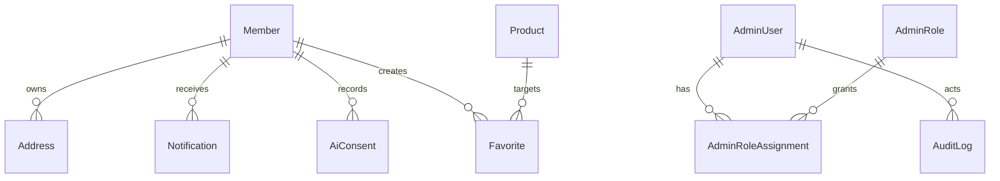
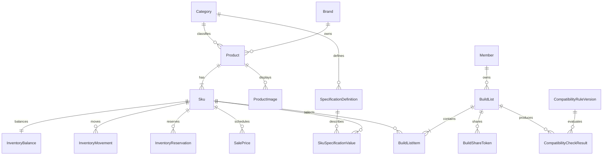
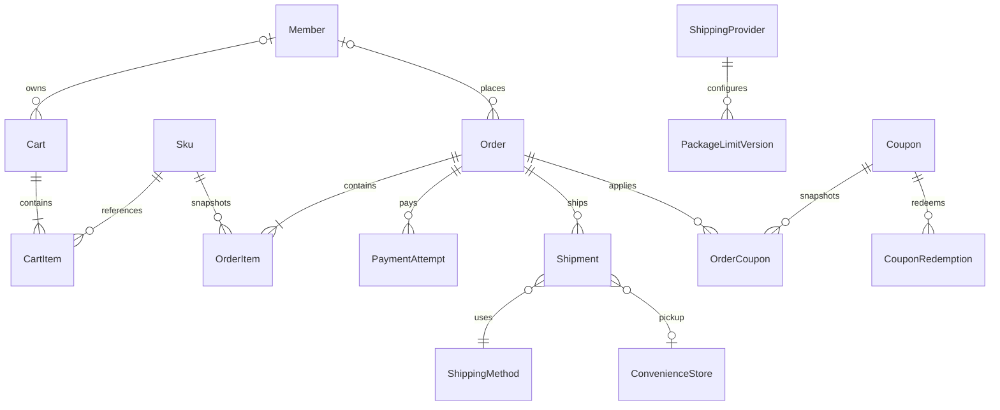
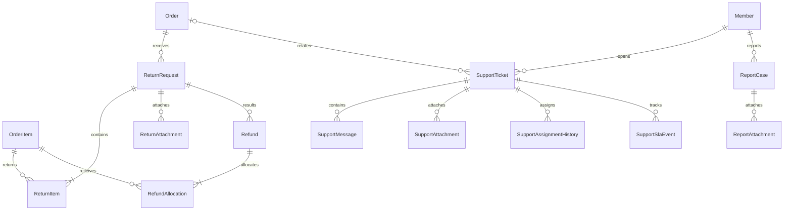
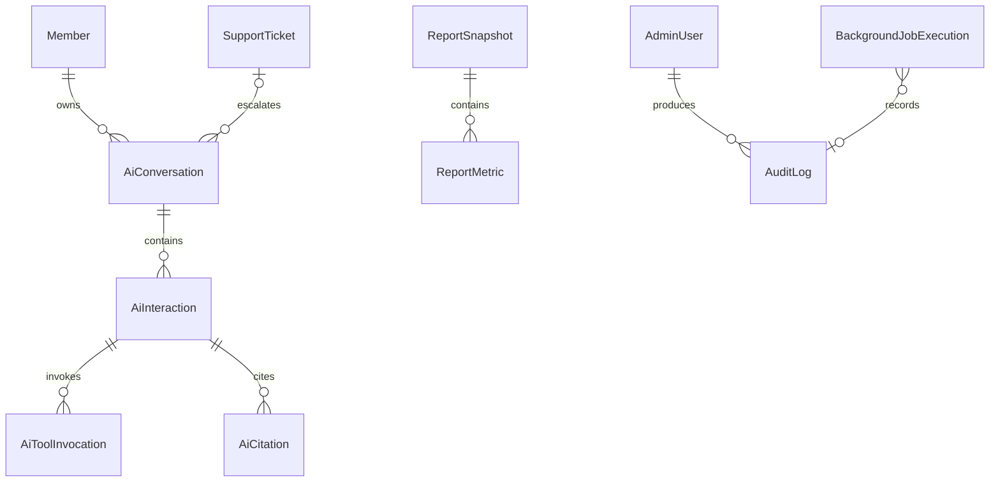

# 資料模型與 ERD

本文件是涵蓋 M 功能的邏輯 ERD 骨架，用來確認領域邊界與關聯。它不是 EF Core Migration，也未決定所有 SQL Server 型別、Null、索引或刪除行為；這些內容需在資料字典與實作前審核。

## 會員、權限與通知

- 會員與管理員採不同登入邊界；是否共用底層 Identity 表由實作設計決定，不在邏輯模型中假定。
- Email、正規化 Email 與其他登入識別需要唯一性；精確索引等待資料字典。
- 多角色權限取聯集，敏感操作仍以明確 Policy 授權並保存稽核。

## 商品、SKU、庫存與組裝

- Product 是共用商品資訊，SKU 是可定價、可庫存與可下單單位。
- 同一 SKU 同一時間不可有重疊有效特價。
- InventoryBalance 保存目前聚合數量；所有保留、釋放、出貨、退貨回補與隔離需留下 InventoryMovement。
- InventoryReservation 必須能回連 Cart／Order 用途、數量、到期時間與釋放原因。
- 相容性結果必須保存規則版本；AI 不能修改或取代結果。

## 購物車、訂單、付款與物流

- OrderItem 保存商品名稱、SKU、成交單價、成本、折扣分攤、組裝群組及數量快照。
- Order 保存收件、運費、免運規則、組裝費、優惠與總額快照；歷史訂單不受後台設定變更影響。
- PaymentAttempt 與物流模擬通知需要外部識別、冪等鍵、狀態及原始事件摘要。
- 訪客訂單不強制關聯 Member，使用另行保護的存取 Token 查詢。

## 退貨、退款與客服

- SupportTicket、ReportCase 與 ReturnRequest 是三個獨立 Aggregate，不共用案件主表。
- 統一工作台是三領域的唯讀投影／查詢模型，不因此建立可跨領域寫入的共同 Entity。
- 退款分攤必須回連原 OrderItem 與原折扣快照，支援單項退貨及部分退款。
- 附件資料表只保存私有儲存識別與中繼資料，檔案內容不放 SQL Server。

## AI 互動、報表與稽核

- AiInteraction 保存用途、模型、Token、成本估算、結果、降級與 Prompt／Schema／工具契約版本，不保存不必要個資。
- 報表第一版以正式交易表即時彙總；ReportSnapshot 是否建立只由效能量測後的決策決定。
- AuditLog 必須能識別操作者、操作、資源、時間、結果、Correlation ID 與必要差異摘要，禁止保存密碼或完整 Token。

## 重要約束清單

| 約束 | 目的 | 狀態 |
|---|---|---|
| SKU Code 唯一 | 匯入、訂單與庫存穩定識別 | 已確認需求 |
| 庫存不可超賣 | 最後庫存併發時只允許合法保留 | 已確認需求 |
| 特價有效期間不重疊 | 避免同一 SKU 多個有效價格 | 已確認需求 |
| 訂單與付款冪等鍵唯一 | 防止重複副作用 | 已確認需求 |
| Coupon Redemption 唯一／計數受交易保護 | 防止超用 | 已確認需求 |
| 每個 Published Provider Profile 時間點唯一有效 | 防止包裹規則重疊 | 已確認需求 |
| RowVersion 用於可併發編輯資源 | 回傳 409 而非靜默覆寫 | 已確認需求 |
| 三案件領域各自保存狀態歷程 | 保持邊界與稽核 | 已確認需求 |

## 尚未定版

- 每個 Entity 的完整欄位、SQL Server 型別、Null、預設值、刪除行為及索引。
- Identity 實體表與業務 Member／Admin Profile 的實體對應方式。
- 商品 CSV 三邏輯資料集的封裝方式與匯入暫存資料表。
- 各物流 Provider Profile 實際尺寸／重量上下限。
- 圖片、附件與 AI 紀錄清理時的實體刪除策略。
