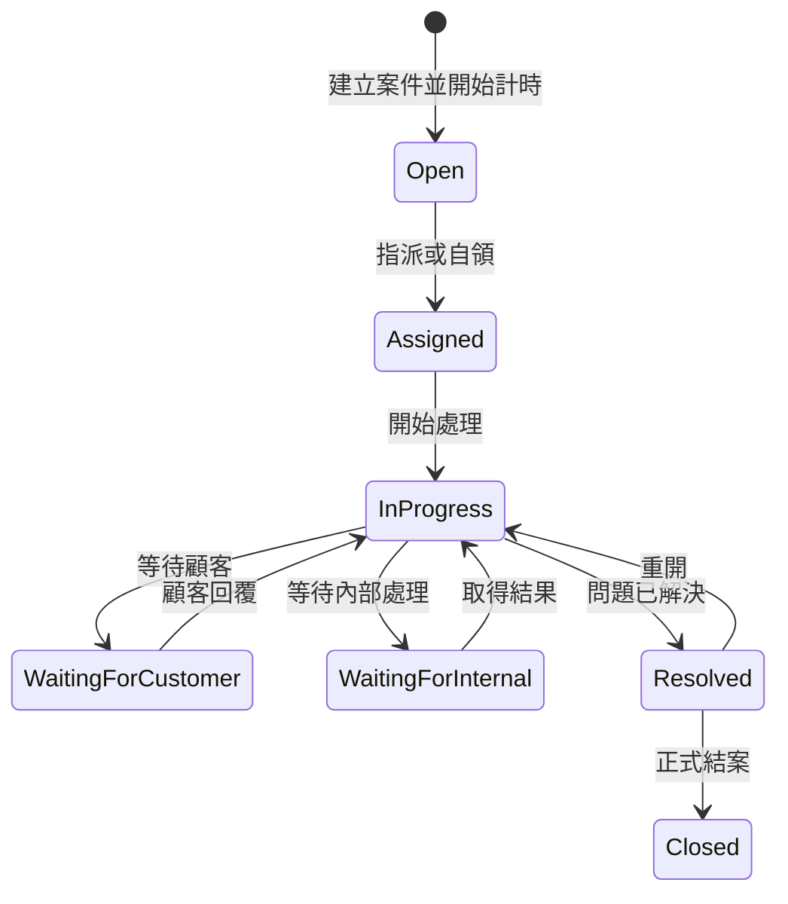

# SLA（服務等級協議）

## 什麼是 SLA

SLA 是 **Service Level Agreement** 的縮寫，中文通常稱為「服務等級協議」。

它用可量化的條件，定義服務應在多快的時間內得到回應或完成處理。在本電商系統中，SLA 主要用來管理及衡量人工客服案件的處理速度。

SLA 不只是畫面上的倒數時間，還必須明確定義：

- 從什麼事件開始計時。
- 哪些事件代表達成目標。
- 哪些狀態會暫停計時。
- 是否只計算營業時間。
- 逾時前後如何通知及升級。
- 案件重開後如何重新計算。

## 本系統的主要 SLA 指標

### 首次人工回覆時間

從客服案件建立，到第一位人工客服送出有效回覆所經過的時間。

```text
FirstResponseDuration
= FirstHumanResponseAt - CreatedAt - PausedDuration
```

在本系統中，AI 客服的自動回答原則上不等於人工首次回覆。是否正式採用此規則，仍應以專案決策紀錄為準。

### 目標結案時間

從案件建立，到案件進入 `Resolved` 或指定結案狀態所經過的有效處理時間。

```text
ResolutionDuration
= ResolvedAt - CreatedAt - PausedDuration
```

必須先決定以 `Resolved` 或 `Closed` 作為 SLA 達成點：

- `Resolved`：客服已提出解決方案，顧客仍可能重開。
- `Closed`：案件正式關閉，不再接受一般訊息。

### SLA 達成率

```text
首次回覆 SLA 達成率
= 期限內首次人工回覆的案件數 / 應計算案件數 × 100%

結案 SLA 達成率
= 期限內完成處理的案件數 / 應計算案件數 × 100%
```

報表必須說明是否排除取消案件、測試資料、重開案件及仍在處理中的案件。

## 優先級與期限

客服案件通常依影響程度分成：

| 優先級 | 常見意義 | 案例 |
|---|---|---|
| `Low` | 一般詢問，沒有立即影響 | 商品規格或保固方式詢問 |
| `Normal` | 一般服務問題 | 訂單進度或付款問題 |
| `High` | 明顯影響交易或履約 | 已付款但訂單狀態異常 |
| `Urgent` | 嚴重風險，需要優先介入 | 帳號安全、重複扣款或大量訂單異常 |

以下僅是期限設計示例，不是本專案的正式決策：

| 優先級 | 首次人工回覆 | 目標結案 |
|---|---:|---:|
| `Low` | 24 小時 | 5 天 |
| `Normal` | 8 小時 | 3 天 |
| `High` | 4 小時 | 24 小時 |
| `Urgent` | 1 小時 | 8 小時 |

> [!warning] 專案決策邊界
> 實際期限、優先級判定及計時方式目前由決策互動文件處理。本頁的數值只能作為理解 SLA 的例子，不得直接當作需求或驗收條件。

## 計時方式

### 日曆時間

以每天 24 小時連續計時，包括夜間、週末及假日。

優點：

- 實作與測試較簡單。
- 到期時間容易理解。
- 不需要維護工作日與假日資料。

缺點：

- 非營業時間仍會消耗 SLA。
- 對沒有輪班制度的小型客服團隊可能不公平。

### 營業時間

只在設定的客服營業時段內計時，例如週一至週五 09:00～18:00。

優點：

- 較符合實際客服人力安排。
- 報表能反映真正可處理案件的時間。

缺點：

- 需要定義時區、週末、國定假日及臨時休假。
- 到期時間及測試案例較複雜。

## 暫停計時

常見可考慮暫停 SLA 的情況：

- `WaitingForCustomer`：等待顧客補充照片、訂單資訊或回覆。
- 等待外部物流商或金流商提供處理結果。

通常不建議因內部人員忙碌而暫停 SLA，否則報表無法反映真正的處理延誤。

若允許暫停，需要保存每一段暫停紀錄：

```text
SupportSlaPause
├─ SupportTicketId
├─ Reason
├─ StartedAt
├─ EndedAt
├─ CreatedBy
└─ Duration
```

不能只在案件主表保存一個累計數字，否則無法稽核暫停原因。

## 案件重開

案件從 `Resolved` 回到 `InProgress` 時，需要決定：

- 沿用原本剩餘的結案期限。
- 重新給予一段結案期限。
- 視為新的 SLA 計算區段，但仍屬同一案件。

無論採用哪一種方式，首次回覆是否達成都不應因案件重開而被覆蓋。

## 逾時通知與升級

SLA 通常包含兩個提醒階段：

```text
接近期限
→ 通知目前負責客服
→ 仍未處理
→ 標記逾時
→ 通知主管或升級優先級
```

系統可保存：

- 首次回覆期限 `FirstResponseDueAt`。
- 結案期限 `ResolutionDueAt`。
- 首次人工回覆時間 `FirstHumanResponseAt`。
- 解決時間 `ResolvedAt`。
- 是否首次回覆逾時。
- 是否結案逾時。
- 暫停秒數或獨立暫停歷程。
- SLA 規則版本。

保存規則版本可以避免管理員修改期限後，歷史案件的 SLA 結果跟著改變。

## 與客服狀態機的關係



狀態轉移會影響 SLA 是否繼續、暫停、達成或重新計算，因此狀態更新與 SLA 歷程應在同一個後端使用案例及資料庫交易中完成。

## 背景工作

SLA 不應只依賴使用者開啟頁面時才檢查。背景工作應定期：

1. 找出即將到期的案件。
2. 建立站內通知或 Email 通知。
3. 找出已逾時案件。
4. 更新可查詢的逾時狀態。
5. 通知客服主管或執行升級規則。
6. 保證同一事件不會重複通知。

即使背景工作延遲執行，是否逾時仍應以原始期限與事件時間計算，不能以排程實際執行時間取代。

## 後台呈現

客服工作台可顯示：

- 距離首次回覆期限的剩餘時間。
- 距離目標結案期限的剩餘時間。
- 即將逾時、已逾時或已達成標記。
- 暫停原因及累計暫停時間。
- 各優先級與分類的 SLA 達成率。

排序時通常應讓「已逾時」及「最接近期限」的案件優先，而不是只依建立時間排列。

## 本系統仍待決策的項目

相關決策集中於目前互動批次：

- SLA 使用日曆時間或營業時間。
- 各優先級首次回覆及結案期限。
- 等待顧客或等待內部時是否暫停。
- 重開案件如何重新計時。
- 主管角色及逾時升級方式。
- SLA 是否只適用一般客服，或延伸至檢舉及退貨。

參考：[[05-規劃/決策/00-互動中/DEC-BATCH-002-第二批核心決策]]。
